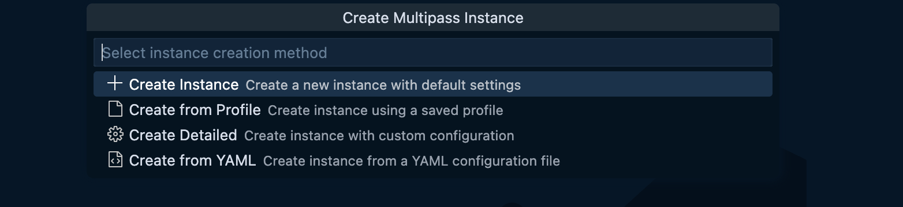
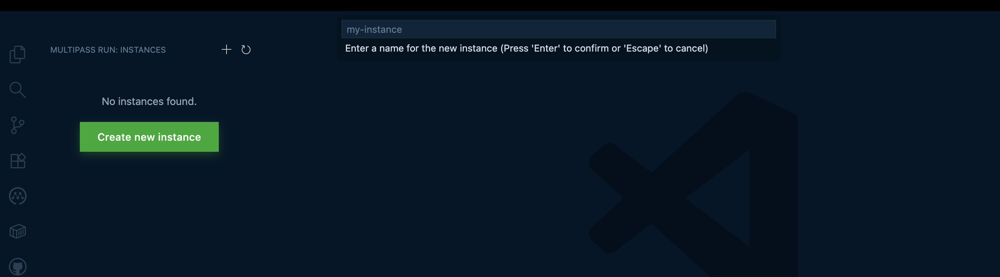
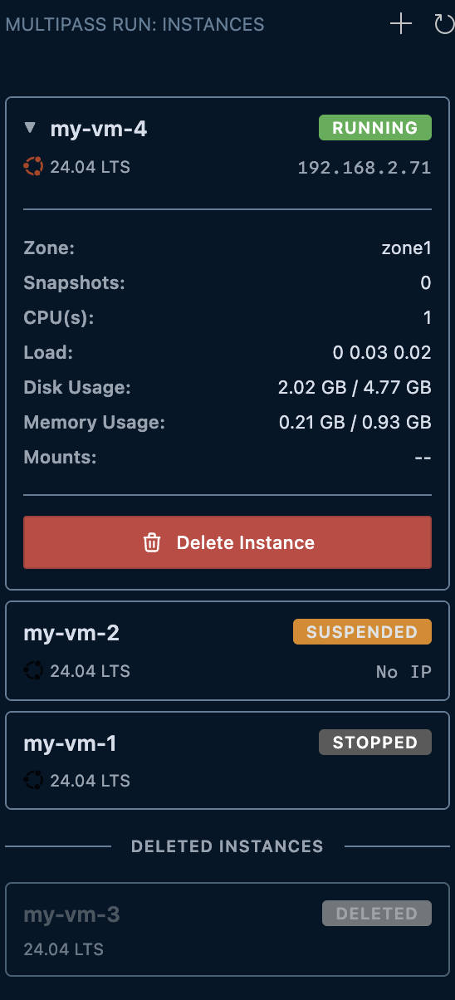

# Multipass Run

A Visual Studio Code extension for managing Multipass virtual machine instances directly from the editor interface.

## Overview

Multipass Run provides a graphical interface for interacting with Multipass Ubuntu instances. The extension integrates seamlessly with VS Code's sidebar, offering real-time status monitoring and instance lifecycle management without requiring terminal access.

## Features

### Instance Management

View and manage all Multipass instances from the VS Code sidebar. The extension displays active and deleted instances with distinct visual indicators and state badges.


### Instance Creation

Create new Ubuntu instances using one of two methods:

- Quick creation with default configuration
- Custom creation with user-defined CPU, memory, and disk parameters





### Instance Information

Access detailed system metrics for running instances:

- CPU count and current load average
- Memory allocation and usage
- Disk capacity and consumption
- Network configuration (IPv4 address)
- Mount points and snapshot count



### Instance Operations

Execute common operations via context menu:

- Running instances: Suspend, Stop, Delete
- Stopped instances: Start, Delete
- Suspended instances: Resume, Delete
- Deleted instances: Recover, Purge

### User Interface

The extension follows VS Code's design guidelines and provides:

- Real-time instance state indicators
- Automatic status polling for transitional states
- Theme-aware color scheme support
- Ubuntu branding assets

## Prerequisites

### System Requirements

- Visual Studio Code version 1.105.0 or later
- Multipass CLI installed and available in system PATH

### Multipass Installation

Install Multipass on your operating system:

**macOS:**

```bash
brew install --cask multipass
```

**Linux (snap):**

```bash
sudo snap install multipass
```

**Windows:**

Download the installer from [multipass.run](https://multipass.run/)

## Installation

Install the extension from the Visual Studio Code Marketplace:

1. Open the Extensions view (Cmd+Shift+X on macOS, Ctrl+Shift+X on Linux/Windows)
2. Search for "Multipass Run"
3. Select Install

Alternatively, install from a VSIX file:

```bash
code --install-extension multipass-run-0.0.1.vsix
```

## Getting Started

### Initial Setup

1. Ensure Multipass is installed and the `multipass` command is accessible from your terminal
2. Open VS Code
3. Locate the Multipass icon in the Activity Bar (left sidebar)
4. The extension will automatically detect existing instances

### Creating Your First Instance

1. Click the Multipass icon to open the sidebar
2. Select the "+" button in the toolbar
3. Choose "Create new instance with default settings" for quick setup
4. The instance will appear in the list with a "Creating" status
5. Once started, the instance will display its IP address and release information

### Viewing Instance Details

1. Start an instance if it is not already running
2. Click on the instance name in the sidebar
3. The details panel will expand to show system metrics

## How-to Guides

### How to Start a Stopped Instance

1. Right-click the stopped instance in the sidebar
2. Select "Start Instance" from the context menu
3. The instance state will change to "Starting", then "Running"

### How to Suspend a Running Instance

1. Right-click the running instance
2. Select "Pause (Suspend)" from the context menu
3. The instance will be suspended and marked accordingly

### How to Delete and Recover an Instance

**Delete:**

1. Right-click the instance (must be stopped or suspended)
2. Select "Delete Instance"
3. Choose "Delete" to move to deleted state (recoverable)

**Recover:**

1. Locate the instance in the "DELETED INSTANCES" section
2. Right-click the deleted instance
3. Select "Recover Instance"

### How to Permanently Remove an Instance

1. Delete the instance following the deletion steps above
2. Right-click the deleted instance
3. Select "Purge Instance" (shown in red)
4. Confirm the action - this operation is irreversible

### How to Create a Custom Instance

1. Click the "+" button in the toolbar
2. Select "Create instance with custom configuration"
3. Provide the following parameters:
   - Instance name (alphanumeric with hyphens)
   - CPU count (minimum 1)
   - Memory size (e.g., "1G", "512M")
   - Disk size (e.g., "5G", "10G")
4. Review the configuration summary
5. Select "Create" to provision the instance

## Reference

### Commands

The extension contributes the following commands to the Command Palette:

- `multipass-run.refresh` - Manually refresh the instance list
- `multipass-run.createInstanceMenu` - Open the instance creation menu

### Instance States

The extension displays the following instance states:

- **Running** - Instance is active and accessible
- **Stopped** - Instance is powered off
- **Suspended** - Instance is paused and saved to disk
- **Creating** - Instance is being provisioned
- **Starting** - Instance is booting
- **Stopping** - Instance is shutting down
- **Deleting** - Instance is being moved to deleted state
- **Recovering** - Deleted instance is being restored
- **Deleted** - Instance is in trash (recoverable)

### Configuration

The extension does not currently expose configuration settings. All behavior is derived from the Multipass CLI installation.

## Troubleshooting

### Instance List Not Updating

The extension polls for status updates every 2 seconds when instances are in transitional states. If updates appear delayed:

1. Click the refresh button in the toolbar
2. Verify Multipass daemon is running: `multipass version`
3. Check system resources if instances are slow to start

### Command Not Found

If the extension cannot locate the Multipass CLI:

1. Verify installation: `which multipass`
2. Ensure the command is in your PATH
3. Restart VS Code after installing Multipass

### Images Not Displaying in Marketplace

If you are viewing this README on the Marketplace and images are not loading, this may indicate a repository configuration issue. Images are hosted in the extension repository and require proper configuration in package.json.

## Known Limitations

- Instance state synchronization may experience latency during rapid operations
- The Multipass CLI must be present in the system PATH
- Detailed information is only available for running instances

## Release Notes

### Version 0.0.1

Initial release:

- Instance list view with active and deleted sections
- Instance creation with default and custom parameters
- Lifecycle management: start, stop, suspend, delete
- Recovery and purging of deleted instances
- Detailed metrics view for running instances
- Context menu for operation access
- Automatic state polling
- Status badge indicators

## Contributing

Contributions are welcome. Please submit issues and pull requests to the [GitHub repository](https://github.com/geoffreynyaga/multipass-run).

## License

This extension is licensed under the MIT License. See the [LICENSE](LICENSE) file for details.

## Additional Information

- [Multipass Documentation](https://multipass.run/docs)
- [VS Code Extension API](https://code.visualstudio.com/api)
- [Canonical](https://canonical.com/)
