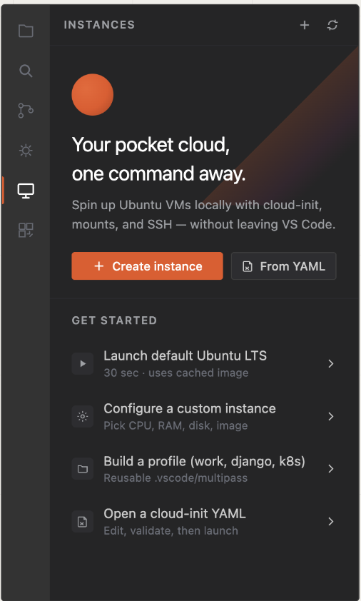

# Multipass Run

[](https://github.com/geoffreynyaga/multipass-run/actions/workflows/test-ubuntu.yml)
[](https://github.com/geoffreynyaga/multipass-run/actions/workflows/test-macos.yml)
[](https://github.com/geoffreynyaga/multipass-run/actions/workflows/test-windows.yml)
[](https://opensource.org/licenses/MIT)
[](https://marketplace.visualstudio.com/items?itemName=GeoffreyNyaga.multipass-run)

VS Code extension for managing Multipass virtual machine instances from the sidebar.



- Manage Ubuntu, Fedora, Debian, and Ubuntu Core instances from the sidebar.
- Create instances with default, custom, or cloud-init configurations.
- Take, list, restore, and delete snapshots on stopped instances.
- Mount and unmount host folders per instance.
- Connect with Remote-SSH using a generated ed25519 key.

## Install

### Prerequisites

- Visual Studio Code 1.105.0 or later.
- Multipass installed and on `PATH`. Verify with `multipass version`.

### Install Multipass

**macOS** — Download the installer from [multipass.run](https://multipass.run/), or use Homebrew (community-supported):

```bash
brew install --cask multipass
```

**Linux** — Install from the Snap Store:

```bash
sudo snap install multipass
```

**Windows** — Download the installer from [multipass.run](https://multipass.run/).

### Install the extension

From the Marketplace:

1. Open the Extensions view (`Cmd+Shift+X` on macOS, `Ctrl+Shift+X` on Linux and Windows).
2. Search for `Multipass Run`.
3. Select **Install**.

From a VSIX file:

```bash
code --install-extension multipass-run-0.1.0.vsix
```

## How-to guides

### How to create an instance

1. Click the Multipass icon in the Activity Bar.
2. Click the **+** button in the toolbar.
3. Choose one of:
   - **Default settings** — quick provision.
   - **Custom configuration** — set name, CPU count, memory (e.g. `1G`), and disk size (e.g. `5G`).
   - **Cloud-init YAML** — pick a `#cloud-config` file and enter a name.

### How to start, suspend, or stop an instance

Right-click the instance in the sidebar and select the action from the context menu:

- Running → **Stop**, **Pause (Suspend)**.
- Stopped → **Start**.
- Suspended → **Resume**.

### How to delete and recover an instance

1. Right-click a stopped or suspended instance and select **Delete Instance**.
2. The instance moves to the **DELETED INSTANCES** section.
3. To recover, right-click the deleted instance and select **Recover Instance**.

### How to purge an instance

1. Right-click the deleted instance.
2. Select **Purge Instance** (shown in red).
3. Confirm. Purge is irreversible.

### How to mount a host folder

1. Expand the instance in the sidebar.
2. Click the **+** icon next to the **Mounts** header.
3. Pick a host folder in the file dialog.
4. Confirm or edit the target path inside the instance. The default is `/home/ubuntu/<folder-name>`.

Mounts attach on next boot if the instance is stopped. The extension uses classic mounts (SSHFS).

### How to unmount a folder

1. Expand the instance.
2. Click **Unmount** on the mount row.
3. Confirm.

### How to take, restore, and delete snapshots

Snapshots require the instance to be **Stopped**.

1. Stop the instance.
2. Expand it and click the camera icon next to the **Snapshots** header.
3. Optionally provide a name and comment, then click **Take snapshot**. If unnamed, Multipass assigns `snapshotN`.
4. To restore, click **Restore** on a snapshot row. The instance's current state is discarded.
5. To delete, click **Delete** on a snapshot row. Snapshot deletion is permanent.

### How to launch with cloud-init

1. Save your cloud-init YAML. The file must start with `#cloud-config`.
2. Right-click the file in the Explorer and select **Launch VM with this cloud-init**, or click **+** in the sidebar and select **Open cloud-init YAML**.
3. Enter an instance name when prompted.

### How to connect with Remote-SSH

The extension generates an ed25519 key pair on first use and writes a wrapped block into `~/.ssh/config`. To connect, click **SSH** in the instance detail panel.

## Reference

### Commands

| Title | ID |
|---|---|
| Refresh instance list | `multipass-run.refresh` |
| Create instance menu | `multipass-run.createInstanceMenu` |
| Prune orphaned SSH entries | `Multipass: Prune Orphaned SSH Entries` |

### Instance states

| State | Meaning |
|---|---|
| Running | Active. |
| Stopped | Powered off. |
| Suspended | Paused and saved to disk. |
| Creating | Being provisioned. |
| Starting | Booting. |
| Stopping | Shutting down. |
| Deleting | Moving to deleted state. |
| Recovering | Restoring from deleted state. |
| Deleted | In trash. Recoverable until purged. |

## Security

| Area | Behaviour |
|---|---|
| SSH key | ed25519 by default. Existing `multipass_id_rsa` is kept for backward compatibility. Last-VM purge offers to remove the key pair. |
| Config block | Wrapped in `# >>> multipass-run: <name>` / `# <<<` markers. Legacy entries are auto-migrated. |
| Host keys | `StrictHostKeyChecking accept-new` with the standard `known_hosts`. Purge runs `ssh-keygen -R`. |
| Guest key install | `multipass transfer` plus idempotent append. No shell interpolation of the public key. |
| Hygiene | Orphaned config blocks for missing VMs are auto-pruned at activation and via the **Prune Orphaned SSH Entries** command. |

## Contributing

Open issues and pull requests at the [GitHub repository](https://github.com/geoffreynyaga/multipass-run).

## License

MIT. See [LICENSE](LICENSE).

## See also

- [Multipass documentation](https://multipass.run/docs)
- [Changelog](CHANGELOG.md)
