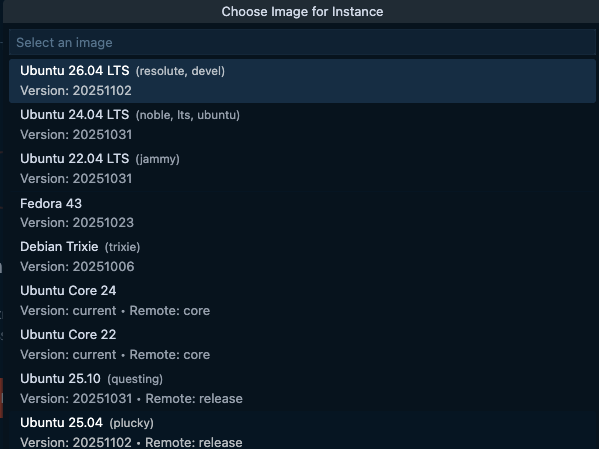
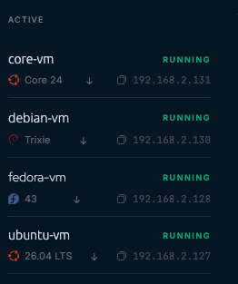
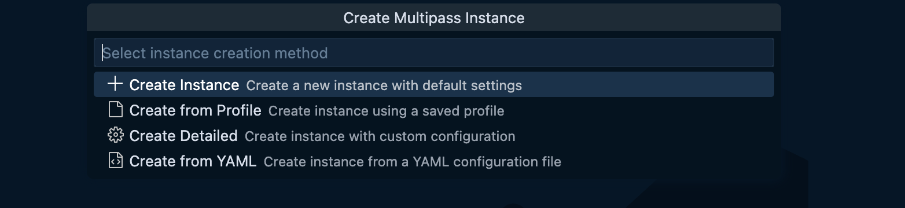
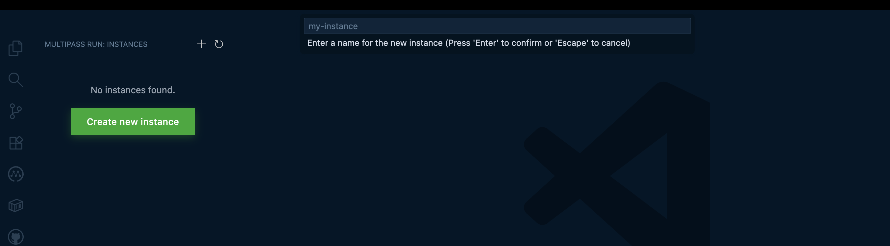
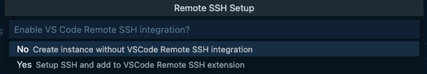
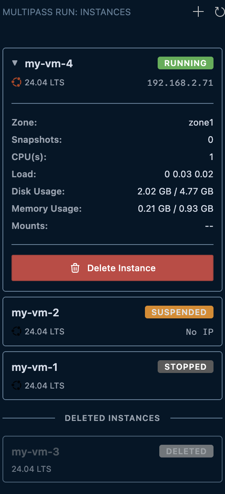

# Multipass Run

[](https://github.com/geoffreynyaga/multipass-run/actions/workflows/test-ubuntu.yml)
[](https://github.com/geoffreynyaga/multipass-run/actions/workflows/test-macos.yml)
[](https://github.com/geoffreynyaga/multipass-run/actions/workflows/test-windows.yml)
[](https://opensource.org/licenses/MIT)
[](https://marketplace.visualstudio.com/items?itemName=GeoffreyNyaga.multipass-run)

A Visual Studio Code extension for managing Multipass virtual machine instances directly from the editor interface.

Multipass Run provides a graphical interface for interacting with Multipass virtual machine instances. The extension integrates with VS Code's sidebar, offering real-time status monitoring and instance lifecycle management.

## Features

<details>
<summary><b>Multi-distribution support</b></summary>

<br>

Create and manage instances from multiple Linux distributions:

- **Ubuntu** - All LTS and current releases (22.04, 24.04, 25.04, etc.)
- **Fedora** - Latest Fedora releases
- **Debian** - Current Debian releases (Trixie, etc.)
- **Ubuntu Core** - IoT and embedded systems

Each distribution is displayed with its own icon for easy identification.



</details>

<details>
<summary><b>Instance management</b></summary>

<br>

View and manage all Multipass instances from the VS Code sidebar. The extension displays active and deleted instances with distinct visual indicators and state badges.



</details>

<details>
<summary><b>Instance creation</b></summary>

<br>

Create new instances using one of these methods:

- Quick creation with default configuration
- Custom creation with user-defined CPU, memory, and disk parameters
- Cloud-init YAML for advanced provisioning





</details>

<details>
<summary><b>Remote-SSH integration</b></summary>

<br>

Automatically configure VS Code's Remote-SSH extension to connect to your Multipass instances:

- SSH key generation and configuration
- One-click connection to instances
- Seamless development environment setup



</details>

<details>
<summary><b>Instance information</b></summary>

<br>

Access detailed system metrics for running instances:

- CPU count and current load average
- Memory allocation and usage
- Disk capacity and consumption
- Network configuration (IPv4 address)
- Mount points and snapshot count



</details>

<details>
<summary><b>Mounts</b></summary>

<br>

Share host folders with an instance directly from the sidebar.

- Add a mount with the **+** button next to the Mounts section: pick a
  host folder, then confirm or edit the in-instance target path
  (defaults to `/home/ubuntu/<basename>`)
- Mounted folders appear as `host source → instance target` rows;
  click **Unmount** on any row to detach
- Works while the instance is Running or Stopped — Multipass attaches
  Stopped mounts on next boot
- Uses **classic** mounts (SSHFS), the Multipass default — universal
  compatibility across backends

> See the Multipass docs:
> [Mount](https://multipass.run/docs/mount), [`mount` command](https://multipass.run/docs/mount-command).

</details>

<details>
<summary><b>Snapshots</b></summary>

<br>

Take, list, restore, and delete instance snapshots from the Snapshots
section of the detail panel.

- Click the camera icon to take a snapshot — optional name and comment
  fields. If unnamed, Multipass uses `snapshotN`
- Each snapshot row shows name, relative time, comment and parent
- **Restore** rolls the instance back to a snapshot (uses
  `--destructive`, so the current state is discarded)
- **Delete** purges a snapshot permanently (snapshots are not
  recoverable after deletion)
- Per Multipass: snapshot, restore, and the snapshot UI are only
  available when the instance is **Stopped**. The UI surfaces a
  `stop instance to snapshot` hint otherwise

> See the Multipass docs:
> [`snapshot` command](https://multipass.run/docs/snapshot-command),
> [`restore` command](https://multipass.run/docs/restore-command).

</details>

<details>
<summary><b>Instance operations</b></summary>

<br>

Execute common operations via context menu:

- Running instances: Suspend, Stop, Delete
- Stopped instances: Start, Delete
- Suspended instances: Resume, Delete
- Deleted instances: Recover, Purge

</details>

<details>
<summary><b>User interface</b></summary>

<br>

The extension follows VS Code's design guidelines and provides:

- Real-time instance state indicators
- Automatic status polling for transitional states
- Theme-aware color scheme support
- Distribution-specific icons (Ubuntu, Fedora, Debian)
- Remote-SSH integration for better development

</details>

## Prerequisites

### System requirements

- Visual Studio Code version 1.105.0 or later
- Multipass CLI installed and available in system PATH

### Multipass installation

Install Multipass on your operating system:

**macOS:**
The supported  method is installing directly  from the Multipass website:
Download the installer from [multipass.run](https://multipass.run/)

Alternatively, you can use Homebrew  (it is community supported and may not always be up to date):

```bash
brew install --cask multipass
```

**Linux (snap):**

```bash
sudo snap install multipass
```

**Windows:**

Download the installer from [multipass.run](https://multipass.run/)

## Installation

Install the extension from the Visual Studio Code Marketplace:

1. Open the Extensions view (Cmd+Shift+X on macOS, Ctrl+Shift+X on Linux/Windows)
2. Search for "Multipass Run"
3. Select Install

Alternatively, install from a VSIX file:

```bash
code --install-extension multipass-run-0.0.1.vsix
```

## Getting started

### Initial setup

1. Ensure Multipass is installed and the `multipass` command is accessible from your terminal
2. Open VS Code
3. Locate the Multipass icon in the Activity Bar (left sidebar)
4. The extension will automatically detect existing instances

### Creating your first instance

1. Click the Multipass icon to open the sidebar
2. Select the "+" button in the toolbar
3. Choose "Create new instance with default settings" for quick setup
4. The instance will appear in the list with a "Creating" status
5. Once started, the instance will display its IP address and release information

### Viewing instance details

1. Start an instance if it is not already running
2. Click on the instance name in the sidebar
3. The details panel will expand to show system metrics

## How-to guides

### How to start a stopped instance

1. Right-click the stopped instance in the sidebar
2. Select "Start Instance" from the context menu
3. The instance state will change to "Starting", then "Running"

### How to suspend a running instance

1. Right-click the running instance
2. Select "Pause (Suspend)" from the context menu
3. The instance will be suspended and marked accordingly

### How to delete and recover an instance

**Delete:**

1. Right-click the instance (must be stopped or suspended)
2. Select "Delete Instance"
3. Choose "Delete" to move to deleted state (recoverable)

**Recover:**

1. Locate the instance in the "DELETED INSTANCES" section
2. Right-click the deleted instance
3. Select "Recover Instance"

### How to permanently remove an instance

1. Delete the instance following the deletion steps above
2. Right-click the deleted instance
3. Select "Purge Instance" (shown in red)
4. Confirm the action - this operation is irreversible

### How to mount a host folder into an instance

1. Expand the instance in the sidebar
2. Click the **+** icon next to the Mounts header
3. Pick a folder on your host in the file dialog
4. Confirm or edit the target path inside the instance (defaults to
   `/home/ubuntu/<folder-name>`)
5. The mount appears in the list. Open a shell into the instance and
   you can read/write the host folder at the chosen path

### How to unmount a folder

1. Expand the instance
2. Click **Unmount** next to the mount row
3. Confirm in the dialog

### How to take, restore, and delete snapshots

Snapshots are only available on **Stopped** instances.

1. Stop the instance from the sidebar (⏹)
2. Expand it and click the camera icon next to the Snapshots header
3. (Optional) provide a name and comment, then click **Take snapshot**
4. To restore: click **Restore** on a snapshot row and confirm. The
   instance's current state is discarded
5. To delete: click **Delete** on a snapshot row and confirm. Snapshot
   deletion is permanent — Multipass does not allow recovery

### How to launch with cloud-init

1. Save your cloud-init YAML (must start with `#cloud-config`)
2. Right-click the file in Explorer → **Launch VM with this cloud-init**
   - Or: Click "+" in the sidebar → **Open cloud-init YAML** → pick your file
3. Enter a VM name when prompted
4. The instance launches with your provisioning script

### How to create a custom instance

1. Click the "+" button in the toolbar
2. Select "Create instance with custom configuration"
3. Provide the following parameters:
   - Instance name (alphanumeric with hyphens)
   - CPU count (minimum 1)
   - Memory size (e.g., "1G", "512M")
   - Disk size (e.g., "5G", "10G")
4. Review the configuration summary
5. Select "Create" to provision the instance

## Reference

### Commands

The extension contributes the following commands to the Command Palette:

- `multipass-run.refresh` - Manually refresh the instance list
- `multipass-run.createInstanceMenu` - Open the instance creation menu

### Instance states

The extension displays the following instance states:

- **Running** - Instance is active and accessible
- **Stopped** - Instance is powered off
- **Suspended** - Instance is paused and saved to disk
- **Creating** - Instance is being provisioned
- **Starting** - Instance is booting
- **Stopping** - Instance is shutting down
- **Deleting** - Instance is being moved to deleted state
- **Recovering** - Deleted instance is being restored
- **Deleted** - Instance is in trash (recoverable)

### Configuration

The extension does not currently expose configuration settings. All behavior is derived from the Multipass CLI installation.

## Troubleshooting

### Instance list not updating

The extension polls for status updates every 2 seconds when instances are in transitional states. If updates appear delayed:

1. Click the refresh button in the toolbar
2. Verify Multipass daemon is running: `multipass version`
3. Check system resources if instances are slow to start

### Command not found

If the extension cannot locate the Multipass CLI:

1. Verify installation: `which multipass`
2. Ensure the command is in your PATH
3. Restart VS Code after installing Multipass

### macOS: mounted folder is empty inside the VM

On macOS, classic mounts use Multipass's `sshfs_server` binary. macOS
TCC (Privacy & Security) silently blocks it from reading user folders
unless granted Full Disk Access. The mount appears attached but `ls`
returns nothing inside the VM.

To fix:

1. Open System Settings → Privacy & Security → Full Disk Access
2. Add and enable both:
   - `/Library/Application Support/com.canonical.multipass/bin/multipassd`
   - `/Library/Application Support/com.canonical.multipass/bin/sshfs_server`
3. Restart the daemon:
   ```bash
   sudo launchctl kickstart -k system/com.canonical.multipassd
   ```
4. Unmount and remount the folder

The Mounts section in the sidebar links directly to the Full Disk
Access pane on macOS.


## Security

The extension edits your `~/.ssh/config`, generates a key pair, and runs
commands inside guest VMs. Key safeguards:

| Area | What we do |
|------|------------|
| SSH key | Default ed25519 (existing `multipass_id_rsa` is kept for backward compat). Last-VM purge offers to remove the key pair. |
| Config block | Wrapped in `# >>> multipass-run: <name>` / `# <<<` markers so removal is robust against manual edits and scribbles. Legacy entries auto-migrated. |
| Host-key policy | `StrictHostKeyChecking accept-new` with the standard `known_hosts` (replaces the old `no` + `/dev/null`). Purge also runs `ssh-keygen -R`. |
| Guest key install | `multipass transfer` + idempotent append — no shell interpolation of the public key. |
| Hygiene | Orphaned config blocks for VMs that no longer exist are auto-pruned at activation and via the `Multipass: Prune Orphaned SSH Entries` command. |

## Known limitations

- Instance state synchronization may experience latency during rapid operations
- The Multipass CLI must be present in the system PATH
- Detailed information is only available for running instances

## Release notes

### Version 0.0.5

- Detail view redesign: action row (Shell / SSH / Stop / Pause), dense
  KV layout for live metrics, optimistic transition pills
- Snapshots: take, list, restore, and delete from the sidebar
- Mounts: add and unmount host folders from the sidebar
- macOS Full Disk Access hint with deep-link to the Privacy pane

### Version 0.0.1

Initial release:

- Instance list view with active and deleted sections
- Instance creation with default and custom parameters
- Lifecycle management: start, stop, suspend, delete
- Recovery and purging of deleted instances
- Detailed metrics view for running instances
- Context menu for operation access
- Automatic state polling
- Status badge indicators

## Contributing

Contributions are welcome. Please submit issues and pull requests to the [GitHub repository](https://github.com/geoffreynyaga/multipass-run).

## License

This extension is licensed under the MIT License. See the [LICENSE](LICENSE) file for details.

## Additional information

- [Multipass Documentation](https://multipass.run/docs)
- [VS Code Extension API](https://code.visualstudio.com/api)
- [Canonical](https://canonical.com/)
